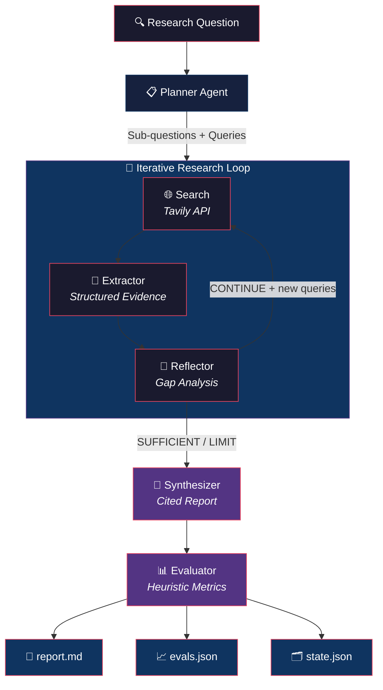

# ProbeAI — Minimal Deep Research Agent

A lightweight, iterative research agent that breaks down complex questions, searches the web, extracts structured evidence, reflects on gaps, and synthesizes a cited report — all powered by a local Ollama LLM and Tavily search.

**No LangChain. No LangGraph. No vector databases. Just clean Python.**

---

## Architecture


### Architecture Overview

ProbeAI follows a modular, agentic workflow designed for deep information retrieval and synthesis:

1.  **Orchestration**: A central loop in `main.py` manages the state and coordinates specialized agents, ensuring a robust and predictable execution path.
2.  **Iterative Research**: The system doesn't just search once. The **Reflector** agent analyzes collected evidence against sub-questions. If it finds gaps or weak support, it triggers additional research cycles with new, targeted queries.
3.  **Evidence-First Extraction**: Data is converted into structured **Evidence** objects with associated metadata (strength, source, sub-question ID), making every claim in the final report fully traceable.
4.  **Heuristic Evaluation**: Research quality is measured using deterministic heuristics rather than LLM-as-a-judge, providing transparent and consistent scores for factuality, authority, and freshness.

### Pipeline Stages

| Stage | Agent | What it does |
|-------|-------|-------------|
| **Plan** | `agents/planner.py` | Breaks the question into 3–6 sub-questions and generates initial search queries |
| **Search** | `services/search.py` | Runs queries via Tavily API, deduplicates results |
| **Extract** | `agents/extractor.py` | Pulls structured evidence (claims, quotes, strength ratings) from search results in batches |
| **Reflect** | `agents/reflector.py` | Assesses evidence coverage, identifies gaps, decides to continue or stop |
| **Synthesize** | `agents/synthesizer.py` | Generates a cited research report with `[E#]`/`[S#]` inline citations |
| **Evaluate** | `services/evaluator.py` | Computes heuristic quality metrics (factuality, authority, freshness, etc.) |

---

## Setup

### 1. Clone & create virtual environment

```bash
git clone https://github.com/your-username/ProbeAI.git
cd ProbeAI

python -m venv venv
source venv/bin/activate        # Linux / macOS
# venv\Scripts\activate          # Windows
```

### 2. Install dependencies

```bash
pip install -r requirements.txt
```

Dependencies (`requirements.txt`):
```
pydantic>=2.0
requests>=2.31
tavily-python>=0.5.0
python-dotenv>=1.0
```

### 3. Configure environment

Copy the example and fill in your keys:

```bash
cp .env.example .env
```

Edit `.env`:

```env
# Required — get your key at https://tavily.com
TAVILY_API_KEY=tvly-xxxxxxxxxxxxx

# Ollama model (must be pulled locally)
OLLAMA_MODEL=llama3.2:latest

# Ollama server URL (default: local)
OLLAMA_BASE_URL=http://localhost:11434

# Research limits
MAX_ITERATIONS=3
MAX_SOURCES=20
MAX_RUNTIME_SECONDS=300
```


### 4. Start Ollama

Make sure Ollama is running with your chosen model:

```bash
ollama pull llama3.2:latest
ollama serve
```

---

## Usage

### Run a research query

```bash
python main.py "Your research question here"
```

### Examples

```bash
# Basic research
python main.py "What are the latest advances in quantum computing?"

# With CLI options
python main.py "Compare React vs Vue in 2025" --max-iterations 5
python main.py "Impact of AI on jobs" --model qwen3:8b
python main.py "Open source browser agents" --max-sources 30 --max-runtime 600
```

### CLI Options

```
python main.py --help

positional arguments:
  question                  The research question to investigate

options:
  -i, --max-iterations N    Maximum research iterations (default: 3)
  -s, --max-sources N       Maximum sources to collect (default: 20)
  -t, --max-runtime N       Maximum runtime in seconds (default: 300)
  -m, --model MODEL         Ollama model to use (default: llama3.2:latest)
  -e, --min-evidence N      Minimum evidence per claim (default: 2)
  -b, --batch-size N        Batch size for extraction (default: 2)
```

---

## Output

Each run produces three files in `runs/<run_id>/`:

```
runs/
└── e6fa9d045da6/
    ├── report.md       # Final research report
    ├── evals.json      # Quality metrics
    └── state.json      # Full execution trace
```

### 📄 `report.md` — Research Report

A structured markdown report with 5 sections:

1. **Executive Summary** — High-level synthesis with inline `[S#]` source citations
2. **Key Findings** — Numbered findings, each citing evidence. Includes strong/weak evidence annotations
3. **Evidence Table** — Every extracted claim with strength badge (🟢🟡🟠🔴) and source link
4. **Open Questions & Uncertainty** — Unresolved areas and evidence gaps
5. **Sources** — Numbered `[S#]` index of all URLs

### 📈 `evals.json` — Quality Metrics

Deterministic, heuristic-based evaluation scores (no LLM judging):

```json
{
  "factuality_score": 0.72,
  "source_diversity": 9,
  "source_categories": { "tech": 3, "social": 1, "other": 24 },
  "source_authority_score": 0.49,
  "uncertainty_calibration": 0.67,
  "iteration_depth": 1,
  "runtime_seconds": 82.5,
  "sources_analyzed": 15,
  "stop_reason": "sufficient_evidence",
  "total_evidence": 28,
  "strong_evidence_count": 11,
  "moderate_evidence_count": 10,
  "weak_evidence_count": 7,
  "speculative_evidence_count": 0,
  "avg_evidence_per_subquestion": 2.0,
  "redundant_evidence_pairs": 0,
  "freshness_score": 1.0,
  "reflection_quality": {
    "total_reflections": 1,
    "continue_decisions": 0,
    "new_queries_generated": 2,
    "gaps_identified": 0,
    "iterative_behavior": false
  }
}
```

| Metric | What it measures |
|--------|-----------------|
| `factuality_score` | Weighted average of evidence strength (strong=1.0, moderate=0.7, weak=0.3, speculative=0.1) |
| `source_diversity` | Number of unique domains |
| `source_authority_score` | Domain-based authority (.gov/.edu = 1.0, techcrunch = 0.6, reddit = 0.3) |
| `uncertainty_calibration` | How well the report acknowledges uncertainty |
| `freshness_score` | Recency of evidence (2026 = 1.0, 2024 = 0.6, etc.) |
| `reflection_quality` | Whether reflections drove meaningful iteration |

### 🗂️ `state.json` — Execution Trace

The full state of the research run, including:

- Research plan (sub-questions, initial queries)
- All search results (titles, URLs, snippets)
- All extracted evidence (claims, strength, sources)
- Reflection decisions and gap analysis per iteration
- Iteration summaries (queries used, sources found, timing)
- Final report data
- Stop reason (`sufficient_evidence`, `iteration_limit`, `source_limit`, `runtime_limit`)

---

## Project Structure

```
ProbeAI/
├── main.py                  # Orchestration loop: Plan → Search → Extract → Reflect → Synthesize → Evaluate
├── config.py                # All settings, limits, API keys (reads from .env)
├── utils.py                 # Ollama client, JSON parsing, persistence, logging, timer
│
├── agents/
│   ├── planner.py           # Breaks question into sub-questions + search queries
│   ├── extractor.py         # Extracts structured evidence from search results
│   ├── reflector.py         # Assesses coverage, decides continue/stop
│   └── synthesizer.py       # Generates cited report + markdown formatting
│
├── services/
│   ├── search.py            # Tavily search with deduplication
│   ├── fetcher.py           # URL content fetching
│   └── evaluator.py         # Heuristic quality metrics (factuality, authority, freshness)
│
├── models/
│   └── schemas.py           # Pydantic models: Evidence, SubQuestion, FinalReport, RunState
│
├── prompts/
│   ├── planner_prompt.txt   # Planning prompt template
│   ├── extractor_prompt.txt # Evidence extraction prompt template
│   ├── reflector_prompt.txt # Reflection/gap analysis prompt template
│   └── synthesizer_prompt.txt # Report synthesis prompt template
│
├── runs/                    # Output directory (one folder per run)
├── requirements.txt
├── .env.example
└── .gitignore
```

---

## Config Reference

All settings are in `config.py` and can be overridden via `.env` or CLI flags:

```python
# config.py — key settings

OLLAMA_MODEL = "llama3.2:latest"     # Any pulled Ollama model
OLLAMA_BASE_URL = "http://localhost:11434"

MAX_ITERATIONS = 3                    # Research loop iterations
MAX_SOURCES = 20                      # Total search results cap
MAX_RUNTIME_SECONDS = 300             # Hard timeout
MIN_EVIDENCE_PER_CLAIM = 2           # Minimum evidence per sub-question

SEARCH_RESULTS_PER_QUERY = 5         # Results per Tavily query
MAX_QUERIES_PER_ITERATION = 3        # Queries per loop iteration
EXTRACTION_BATCH_SIZE = 2            # Search results processed per LLM call
```

---

## How It Works

1. **Plan** — The Planner agent decomposes your question into atomic sub-questions and generates targeted search queries.

2. **Search → Extract → Reflect (loop)** — For each iteration:
   - Search queries run through Tavily
   - The Extractor pulls structured evidence (claims, sources, strength ratings) in batches
   - Near-duplicate and vague claims are filtered out automatically
   - The Reflector checks coverage against sub-questions and decides: `CONTINUE` (with new queries), `SUFFICIENT`, or `UNANSWERABLE`

3. **Synthesize** — Once evidence is sufficient (or limits are hit), the Synthesizer produces a cited report with `[S#]` source markers, calibrated uncertainty language, and evidence-quality annotations.

4. **Evaluate** — The Evaluator computes deterministic quality metrics and writes `evals.json` — no LLM-as-judge, just heuristics.

---

## License

MIT
